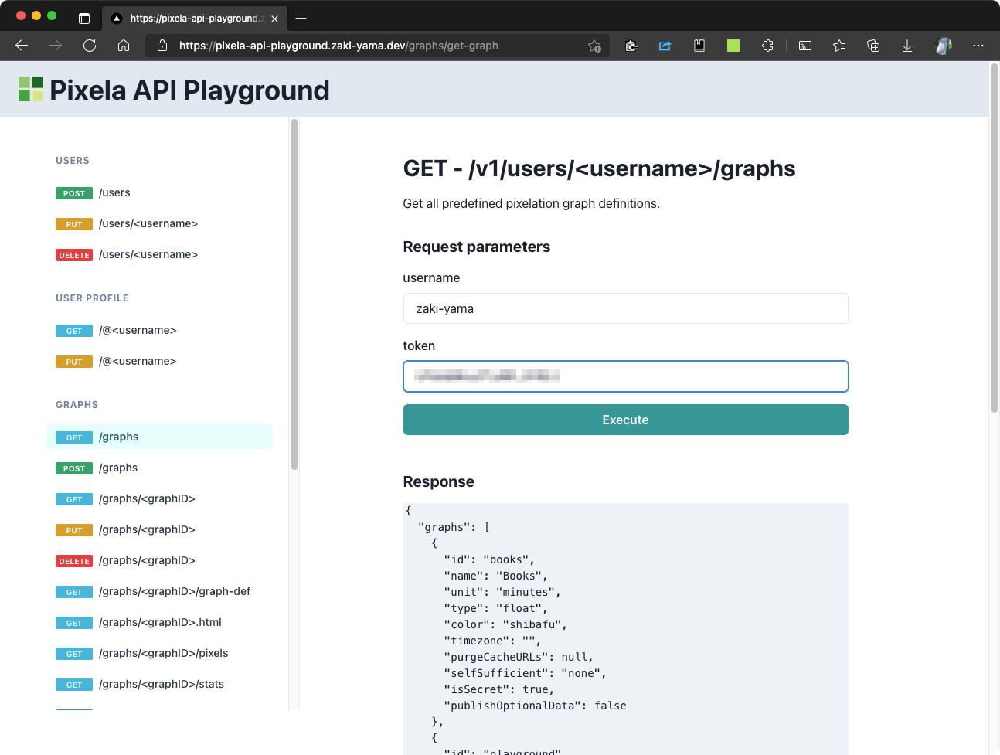

# Pixela API Playground

Try [Pixela API](https://pixe.la/) on the browser!



## Usage

Open https://pixela-api-playground.zaki-yama.dev.

## How to Develop

First, run the development server:

```bash
npm run dev
# or
yarn dev
```

Open [http://localhost:3000](http://localhost:3000) with your browser to see the result.
